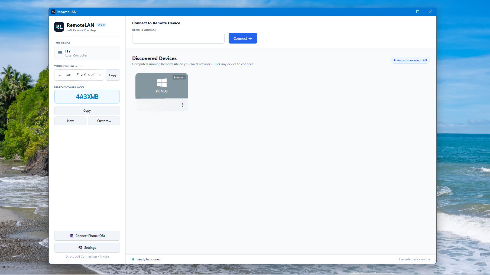

# RemoteLAN

[](https://semver.org)
[](https://github.com/salmanasmat/RemoteLAN/releases)
[](https://dotnet.microsoft.com/download/dotnet/8.0)
[](https://www.microsoft.com/windows)
[](#)

A high-performance, custom, LAN-only remote desktop tool for internal office use built with **C# / .NET 8 / WPF**, designed to work like **AnyDesk** — every installation can connect out to other machines or accept incoming connections over direct TCP sockets. Zero third-party cloud infrastructure or relay servers required.

<p align="center">
  
</p>

- **AnyDesk-Style Unified App**: Both PC A and PC B install and run the exact same `RemoteLAN` application.
- **Bidirectional Control**: Connect from PC A to PC B, or from PC B to PC A, or simultaneously.
- **Zero Cloud Relay**: Direct TCP socket connections between machines on your trusted local area network.
- **Continuous Auto-Discovery & Multi-NIC Deduplication**: Automatically discovers active RemoteLAN PCs on your subnet in the background using persistent, stable Machine GUIDs (`agent.id`). Multi-homed machines (Ethernet + Wi-Fi) are deduplicated into exactly one tile per machine ID, automatically prioritizing wired Ethernet over Wi-Fi with overridable adapter selection.
- **In-Session Ephemeral Chat (AnyDesk/TeamViewer Style)**: Full bidirectional text messaging between controller and agent during an active remote session:
  - **Zero-Footprint Ephemeral Lifetime**: Pure in-memory architecture (`ChatViewModel`) with no files, logs, or persistent storage. Completely wiped the instant the session disconnects.
  - **Controller Slide-Out Drawer**: Collapsible chat panel integrated directly into `SessionWindow` with unread message badges on the top toolbar and live typing indicators.
  - **Agent Floating Desktop Overlay (`HostChatWindow`)**: Unobtrusive, topmost, chromeless widget floating on the host PC desktop. Starts as a compact pill, expands on click or incoming message, supports dragging, and self-destructs on disconnect.
  - **Input Keyboard Isolation**: Complete focus separation ensuring keystrokes typed into chat inputs are never forwarded to the remote host machine.
- **System Tray Minimization**: Closing the application window (clicking 'X') hides RemoteLAN to the Windows System Tray notification area, keeping the agent server and discovery listening in the background.
- **Clean Modern Light Mode UI**:
  - **Left Vertical Sidebar**: Displays This PC's identity, IP address, and alphanumeric session access code with one-click copy, regeneration, and custom code assignment, with a quick-access Settings launcher.
  - **Top Horizontal Header**: Streamlined remote address input with instant reachability validation before requesting authentication.
  - **Interactive Device Grid**: Discovered LAN machines shown as square cards with machine name, preferred IP, active connection badge (Ethernet / Wi-Fi), and online badge — click to connect.
- **Fast Screen Streaming & Real-Time Lock Screen Control**: High-performance DXGI Desktop Duplication engine with automatic GDI fallback and dynamic desktop switching (`DesktopManager`). Gracefully handles session locks, UAC prompts, and lock screens across session boundaries.
- **Windows OS Password Save & Automated Sign-In Screen Unlock**: Save remote Windows user passwords per computer. Credentials resolve across stable Machine GUIDs, hostnames, and IP addresses, surviving DHCP changes and multi-NIC adapter transitions. Lock screen unlock employs native Secure Attention Sequence (`SendSAS`), CapsLock normalization, and hardware scan code synthesis to reliably wake and unlock the Windows logon screen without keystroke drops.
- **Persistent Device History & Live Status Indicators**: Discovered LAN machines remain saved in device history even when powered down or disconnected. Cards feature real-time status indicators (vibrant green `#22C55E` when online, slate gray `#94A3B8` with card dimming and last-seen timestamp when offline). A 3-dots kebab menu allows configuring OS passwords, forgetting saved credentials, and removing entries from history.
- **Automatic Administrator Elevation & Secure Desktop Control**: Built-in application manifest and startup elevation routines automatically launch RemoteLAN with Administrator privileges (and seamless transition to `SYSTEM` token via Winlogon duplication) without requiring manual in-app restart clicks, ensuring full access to the Windows Secure Desktop and sign-in screen.
- **Unified Actions Control Center**: Consolidated `⚡ Actions ▾` menu in the remote viewer toolbar containing **Send Ctrl+Alt+Del**, **🔑 OS Login**, **Send remote input toggle**, **Lock Remote PC on Session End** (off by default), and remote power management (**Lock Workstation**, **Sleep / Suspend**, **Restart PC...**, and **Shut Down PC...**).
- **Interactive Incoming Connection Approval (AnyDesk-Style)**: When connecting without a saved PIN, the controller PC presents the PIN prompt while concurrently requesting approval in the background. The remote PC displays an incoming connection request dialog with **✓ Accept** and **✕ Dismiss** buttons. Clicking **Accept** on the remote PC establishes the session immediately without requiring the controller to enter the access code.
- **Intelligent Connection IP Selector with Adapter Prioritization & Offline Indicator**: The local IP address selector and multi-NIC endpoint dropdown intelligently prioritize active network adapters. If both Ethernet and Wi-Fi are available, Ethernet is selected as the default connection; if only one is available, that adapter is chosen. Dropdown items clearly display the actual adapter type (**Ethernet** in blue, **Wi-Fi** in green). When no network connection is detected, the access code is automatically removed (`------`), action buttons (`Copy`, `New`, `Custom...`, `Connect`) are disabled, and a prominent red offline indicator is displayed. Dynamic Windows network event listeners (`NetworkChange`) automatically restore connectivity and regenerate/display access codes the instant a network cable or Wi-Fi reconnects.
- **True Borderless Fullscreen with Peek Toolbar**: Fullscreen mode completely expands the remote desktop to fill the screen while hiding toolbars and status bars; hovering near the top edge smoothly reveals the floating peek toolbar.
- **Natural Mouse Pointer & Dynamic Resolution**: Standard mouse arrow pointer in the remote desktop viewport (eliminating awkward `+` crosshair cursors), with live dynamic resolution adaptation and aspect-ratio preservation.
- **Resilient Input State Management & Bi-directional Input Control**: Remote mouse movement, clicks, wheel scrolling, and keyboard keystrokes via Win32 `SendInput` with letterbox/pillarbox coordinate mapping and scancode keyboard synthesis.
- **Modern Rounded App Icon & Full Taskbar Integration**: Custom antialiased squircle application icon bundled as multi-resolution `.ico` (16x16 to 256x256) embedded in the Win32 executable, window taskbar, and installer.
- **Dedicated Settings & Security Interface**: Comprehensive, modern Light Mode settings window accessible via the `⚙️ Settings` button in the left sidebar or system tray context menu:
  - **Security PIN Auto-Rotation**: Configurable automatic generation of a fresh host PIN after a specified time interval (Never by default, 15m, 30m, 1h, 4h, 8h, 24h). Active sessions remain uninterrupted.
  - **Unattended Access Control**: Toggle unattended access, configure permanent passwords, and reveal/hide password inputs with dynamic card collapsing.
  - **Scrollable & Responsive Content Layout**: Smooth vertical scrolling containers across Security, General, and About tabs ensuring zero card cropping regardless of screen resolution or DPI scaling.
  - **Unauthorized Access & Brute-Force Protection**: Automatic rate-limiting and temporary IP lockout after repeated failed PIN/password attempts, configurable thresholds, lockout durations, and live status countdown.
- **About Section & Developer Credentials**: Built-in About view providing project details (v1.3.0, GPL-3.0 open source license, technical architecture) and developer credentials (**Salman Asmat**).
- **Semantic Versioning**: Adheres strictly to [SemVer 2.0.0](https://semver.org) (Current version: `1.3.0`).

---

## Architecture

```
RemoteLAN/
├── RemoteLAN.slnx                    # Solution file
├── src/
│   ├── RemoteLAN/                    # Primary Unified AnyDesk-style Application (Host + Client Viewport)
│   └── RemoteLAN.Protocol/           # Shared wire protocol, framing, messages, discovery models
└── tests/
    └── RemoteLAN.Tests/              # Automated unit, discovery, security, power, input pipeline, and lock recovery test suite (105 tests)
```

### Network Protocols

#### 1. LAN Auto-Discovery (UDP Port 9192)
- **Probe**: Broadcasts `REMOTELAN_DISCOVER_V1` across active local network subnets.
- **Response**: Replies with `REMOTELAN_AGENT_V1|{MachineName}|{TcpPort}|{Version}|{MachineId}|{InterfaceType}|{AdapterIp}`.

#### 2. Streaming & Control (TCP Port 9191)
All authentication, desktop video frames, and remote mouse/keyboard inputs multiplex over a single TCP connection:

```
┌─────────────────┬───────────────────────────────┬──────────────────────────────┐
│ MessageType(1B) │ PayloadLength (4B Big-Endian) │ Payload Bytes (Length bytes) │
└─────────────────┴───────────────────────────────┴──────────────────────────────┘
```

##### Message Types
- `0x01` — `AuthRequest` (PIN verification)
- `0x02` — `AuthResponse` (Handshake result & remote screen resolution)
- `0x10` — `ScreenFrame` (JPEG-compressed desktop frame)
- `0x20` — `MouseMove` (Normalized coordinates `0.0–1.0`)
- `0x21` — `MouseButton` (Left, Right, Middle / Down, Up)
- `0x22` — `MouseWheel` (Wheel scroll delta)
- `0x30` — `KeyboardKey` (Virtual Key Code, KeyDown/KeyUp, extended flag)
- `0x35` — `SendCtrlAltDel` (Remote CAD / wake sign-in screen command)
- `0x36` — `PowerAction` (Remote system Lock, Sleep, Restart, Shutdown)
- `0x37` — `UnlockWithOsPassword` (Windows OS lock screen auto-unlock with hardware scan code keystroke injection)

---

## Quick Start

### Prerequisites
- [.NET 8.0 SDK or later](https://dotnet.microsoft.com/download/dotnet/8.0)
- Windows 10/11 or Windows Server

### Build

```powershell
# Build entire solution in Release configuration
dotnet build RemoteLAN.slnx -c Release
```

### Run Tests

```powershell
# Execute full test suite including bidirectional and discovery tests
dotnet test tests/RemoteLAN.Tests/RemoteLAN.Tests.csproj --verbosity normal
```

### Create Installer (Inno Setup)

To compile and package the standalone Windows installer:

```powershell
# Execute automated packaging script
.\build-installer.ps1
```

The compiled installer is output to:
`dist/RemoteLAN_Setup_v1.3.0.exe`

- **Fully Self-Contained (.NET 8 Runtime Included)**: Bundles the complete .NET 8 desktop runtime and CoreCLR libraries directly inside the installer — no separate .NET installation or download required.
- **Clean Upgrades**: Automatically terminates running processes, cleans old version binaries, and preserves user credentials in `%LocalAppData%\RemoteLAN`.
- **Post-Install Launch Option**: Includes a checkbox on the final installer page to launch RemoteLAN immediately into the foreground (checked by default).
- **Automatic Background Startup**: Configures an elevated Windows Scheduled Task (`RemoteLAN_Autostart` with `/RL HIGHEST` at logon) synchronized with the Windows Run registry key (`--background`), allowing silent, unattended startup on boot without UAC prompts even when running on battery.
- **Single-Instance Management**: Prevents duplicate processes; manual launch signals and brings the active background instance to the foreground.
- **System Tray Integration**: Closing the window hides to the notification tray; right-click tray icon to open or exit.
- **Connection Alert**: Main window automatically reveals itself upon incoming remote connection.

### Launching RemoteLAN (Works on Any PC)

Run the unified app on both **PC A** and **PC B**:

```powershell
dotnet run --project src/RemoteLAN/RemoteLAN.csproj
```

#### How it Works:
1. **On PC A**:
   - The left sidebar displays PC A's IP address, an alphanumeric session access code (e.g. `7K2M9X`), and a **Settings** button for unattended access and security configuration.
2. **On PC B**:
   - The left sidebar displays PC B's IP address and its own access credentials.
3. **To connect PC A → PC B**:
   - On PC A, PC B automatically appears as a square device tile in the discovered devices grid.
   - Click PC B's tile (or enter PC B's IP in the top header and click **Connect ➔**).
   - RemoteLAN automatically tests reachability. If reachable, it presents the authentication modal with a **"Remember password for this device"** toggle (or connects instantly if already remembered).
   - Enter PC B's session access code or permanent unattended password and click **Connect ➔**.
   - A dedicated remote desktop session window opens with full mouse and keyboard control!
4. **To connect PC B → PC A**:
   - Exact same process in reverse!

---

## Security

RemoteLAN adheres to strict security standards including constant-time authentication verification (`CryptographicOperations.FixedTimeEquals`), automated brute-force IP lockouts, command-injection prevention, and isolated memory pipelines for input synthesis and credentials. For complete details, audit findings, supported versions, and vulnerability reporting procedures, see [SECURITY.md](SECURITY.md).
